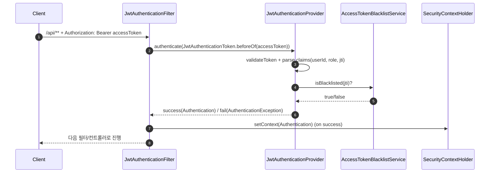
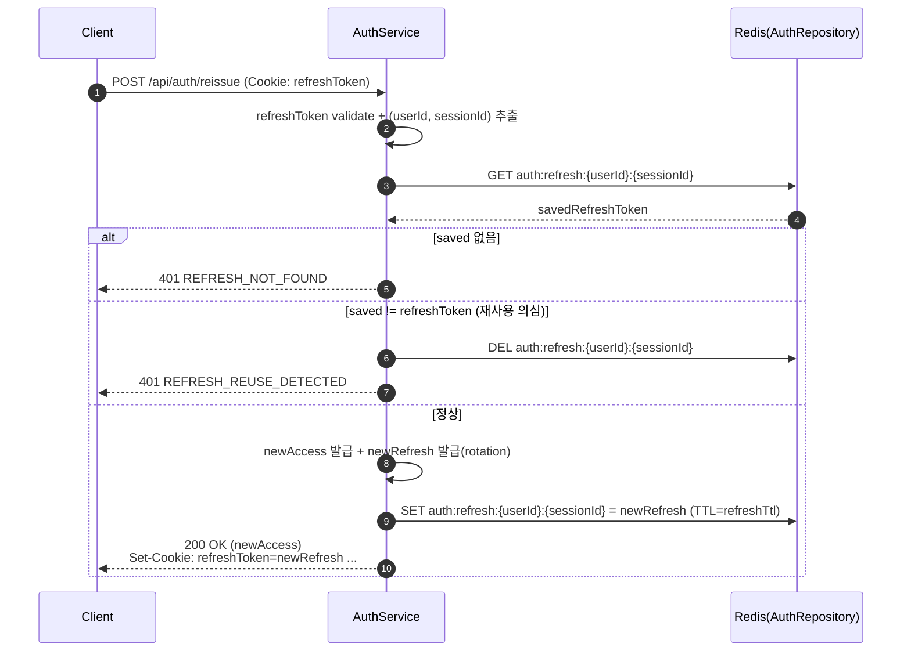

## 목적

`zinex` 프로젝트에서 **Spring Security + JWT(Access/Refresh) + Redis + Cookie**를 적용하면서 학습한 내용을 “공부 자료”로 정리합니다.

- 기본적인 Spring Security 동작 흐름 정리
- 현재 프로젝트에서 적용한 구조 정리 및 정석 구조와 비교
- RefreshToken 재발급/회전(rotation), AccessToken 블랙리스트, 쿠키 저장 등 기법별 목적과 보안 이점 정리
- 디버깅/트러블슈팅 포인트 정리

---

## 1) Spring Security 기본 동작 흐름(일반론)

### 핵심 컴포넌트(개념)

- **SecurityFilterChain**: HTTP 요청을 “필터 체인”으로 처리(인증/인가/예외처리 등)
- **Authentication**: “현재 요청의 사용자/권한”을 표현하는 객체(인증 전/후 상태를 모두 표현)
- **AuthenticationManager**: `authenticate(authentication)`를 수행하는 엔진(보통 `ProviderManager`)
- **AuthenticationProvider**: 실제 인증 로직 수행(예: ID/PW 검증, JWT 검증 등)
- **SecurityContextHolder**: 인증 완료된 `Authentication`을 저장(이후 인가 판단에 사용)
- **ExceptionTranslationFilter + EntryPoint/AccessDeniedHandler**
  - 인증 필요/인증 실패 → 401
  - 권한 부족 → 403

### 전형적인 흐름(요약)

1. 요청이 들어오면 `SecurityFilterChain`이 실행됨
2. 인증이 필요한 경로라면, 인증 필터가 `AuthenticationManager.authenticate(...)` 호출
3. `AuthenticationProvider`가 검증 후 “인증 완료 Authentication”을 반환
4. 필터가 `SecurityContextHolder`에 저장
5. 인가(권한 체크)는 `authorizeHttpRequests` 규칙 + SecurityContext 기반으로 판단
6. 실패하면 401/403 예외 흐름으로 이동(EntryPoint/AccessDeniedHandler)

---

## 2) 현재 프로젝트의 Security/JWT 구조(코드 기준)

### 2.1 주요 파일/역할

- **보호 API 인가/필터 등록**: `src/main/java/namoo/zinex/security/config/SecurityConfig.java`
- **CORS 설정**: `src/main/java/namoo/zinex/security/config/CorsConfig.java`
- **AccessToken 인증 필터**: `src/main/java/namoo/zinex/security/filter/JwtAuthenticationFilter.java`
- **AccessToken 인증 Provider**: `src/main/java/namoo/zinex/security/jwt/JwtAuthenticationProvider.java`
- **JWT 발급/검증/Claims 추출**: `src/main/java/namoo/zinex/security/jwt/JwtTokenService.java`
- **로그인/재발급/로그아웃 API**: `src/main/java/namoo/zinex/auth/controller/AuthController.java`
- **비즈니스 로직**: `src/main/java/namoo/zinex/auth/service/AuthServiceImpl.java`
- **Redis 저장소(Refresh/블랙리스트)**:
  - RefreshToken 저장: `src/main/java/namoo/zinex/auth/repository/AuthRepository.java`
  - AccessToken 블랙리스트: `src/main/java/namoo/zinex/security/jwt/AccessTokenBlacklistService.java`
- **예외 처리**
  - 필터 단계 인증 실패: `security/exception/CustomAuthenticationFailureHandler.java`
  - 인증 필요(unauthenticated) 401: `security/exception/CustomAuthenticationEntryPoint.java`
  - 권한 부족 403: `security/exception/CustomAccessDeniedHandler.java`
  - 컨트롤러/서비스 전역 예외: `core/exception/BaseExceptionHandler.java`

### 2.2 인가 규칙(현재)

`SecurityConfig`의 핵심 정책:

- `/api/auth/**`는 **permitAll**
- `/api/admin/**`는 **ROLE_ADMIN**
- `/api/**`는 **authenticated**
- 그 외 `permitAll`

> 포인트: “필터 제외”와 “permitAll”은 다릅니다.  
> 필터를 제외해도, 인가 규칙이 `authenticated`면 결국 401이 발생할 수 있습니다.

### 2.3 JWT 필터 적용 범위(현재)

인가 규칙과 별개로, `JwtAuthenticationFilter`는 아래 조건에만 적용됩니다.

- **대상**: `/api/**`
- **제외**: `/api/auth/**`, `/swagger-ui/**`, `/swagger-ui.html`, `/v3/api-docs/**`, `/actuator/health/**`

즉,

- `/swagger-ui/**` 같은 문서 경로는 애초에 `/api/**`가 아니라서 인가 규칙에서도 `anyRequest().permitAll()`로 공개되고,
- `/api/**` 중에서도 로그인/재발급 같은 인증 엔드포인트(`/api/auth/**`)는 **필터에서 제외**되어 AccessToken을 요구하지 않습니다.

---

## 3) 토큰 설계(Claims)와 저장 위치

### 3.1 AccessToken(JWT)

- 용도: **API 요청 인증**
- 전달: **HTTP Header** `Authorization: Bearer <accessToken>`
- Claims(중요):
  - `sub`: userId
  - `authorities`: role (`GlobalVariables.ROLE_CLAIM_KEY`)
  - `username`: name(표시 이름, `GlobalVariables.NAME_CLAIM_KEY`)
  - `exp`: 만료
  - `jti`: 토큰 고유 ID(**블랙리스트 키**)

### 3.2 RefreshToken(JWT)

- 용도: **AccessToken 재발급**
- 전달/저장(클라이언트): **HttpOnly Cookie**(`refreshToken`, `GlobalVariables.REFRESH_TOKEN_COOKIE_NAME`)
- Claims(중요):
  - `sub`: userId
  - `sessionId`: 세션 식별자(동시 로그인/세션 구분, `GlobalVariables.SESSION_ID_CLAIM_KEY`)
  - `jti`: refresh 토큰 고유 ID(rotation 시 새로 발급)
  - `exp`: 만료

### 3.3 Redis 저장(서버)

- RefreshToken 저장
  - key: `auth:refresh:{userId}:{sessionId}`
  - value: refreshToken 문자열
  - TTL: refresh 만료시간(예: P7D)
- AccessToken 블랙리스트
  - key: `auth:blacklist:access:{jti}`
  - value: `"1"`
  - TTL: accessToken 만료까지 남은 시간

---

## 4) 요청 흐름별 상세

### 4.1 로그인 (`POST /api/auth/signin`)

- 필터: `/api/auth/**`는 JWT 필터 제외(= AccessToken 인증을 요구하지 않음)
- 컨트롤러: `AuthController.signIn`
- 서비스: `AuthServiceImpl.login`

발생 작업:

1. email/password 검증(DB + `PasswordEncoder.matches`)
2. AccessToken 발급(헤더용)
3. RefreshToken 발급 + `sessionId` 생성(UUID)
4. Redis에 `auth:refresh:{userId}:{sessionId}` 저장
5. RefreshToken을 **HttpOnly 쿠키로 내려줌**

보안 포인트:

- RefreshToken을 JS에서 못 읽게(HttpOnly) 숨김 → XSS 위험 감소

아래는 “로그인 → 토큰 발급/저장”의 큰 흐름입니다.

```mermaid
sequenceDiagram
  autonumber
  participant C as Client
  participant A as AuthController/AuthService
  participant R as Redis(AuthRepository)

  C->>A: POST /api/auth/signin (email/password)
  A->>A: 사용자 검증 + Access/Refresh 발급(sessionId 포함)
  A->>R: SET auth:refresh:{userId}:{sessionId} = refreshToken (TTL=refreshTtl)
  A-->>C: 200 OK (body: accessToken, refreshToken)<br/>Set-Cookie: refreshToken=...; HttpOnly; Secure; SameSite=Strict; Path=/api/auth
```

### 4.2 보호 API 호출(`/api/**`)

- 필터: `JwtAuthenticationFilter`가 동작(단, 제외 경로는 스킵)
- Provider: `JwtAuthenticationProvider`에서 검증

흐름:

1. `Authorization` 헤더에서 Bearer 토큰 추출
2. `jwtTokenService.validateToken(accessToken)` (서명/만료)
3. claims 파싱(userId/role/jti)
4. `AccessTokenBlacklistService.isBlacklisted(jti)` 확인
5. 성공 시 SecurityContext에 Authentication 저장
6. 인가 규칙(`/api/admin/**` role 체크 등) 적용

아래는 “보호 API 요청 시 AccessToken 검증” 흐름입니다.



### 4.3 재발급 (`POST /api/auth/reissue`)

목표: “refreshToken 기반으로 accessToken 재발급” + 정책상 refresh도 rotation.

흐름:

1. 쿠키에서 refreshToken 읽음
2. refreshToken validate + claims 파싱(sub/sessionId)
3. Redis의 저장값과 **문자열 비교**
   - 없으면 `REFRESH_NOT_FOUND`
   - 다르면 `REFRESH_REUSE_DETECTED`(재사용/탈취 의심) + 세션 삭제
4. 새 accessToken 발급
5. 새 refreshToken 발급(rotation) + Redis 갱신
6. 새 refreshToken을 쿠키로 갱신(있을 때만)

보안 포인트:

- **회전(rotation)**: refreshToken 탈취되더라도 재사용 시 탐지 가능(“저장된 값과 다름”)
- 서버가 Redis에 “현재 유효한 refreshToken”만 유지 → 세션 통제

아래는 “재발급 + refresh rotation + 재사용 탐지” 흐름입니다.



### 4.4 로그아웃 (`POST /api/auth/signout`)

목표:

- refresh 세션을 끊고(재발급 권한 제거)
- (옵션) accessToken을 즉시 무효화(블랙리스트)

흐름:

1. 쿠키 refreshToken 검증 + (userId, sessionId) 추출
2. Redis에서 `auth:refresh:{userId}:{sessionId}` 삭제
3. (옵션) 헤더 accessToken이 있고 유효하면 `jti` 추출 후 블랙리스트 등록(남은 TTL만큼)
4. 쿠키 refreshToken 삭제(Set-Cookie maxAge=0)

보안 포인트:

- refresh 삭제: “세션 종료”가 서버 저장소에 반영됨
- access 블랙리스트: access 만료 전에도 즉시 차단(로그아웃 체감 강화)

---

## 5) CORS/쿠키 관련 포인트

현재 `CorsConfig`는:

- `allowCredentials(true)` → 쿠키 기반 refresh를 쓰려면 필요
- `exposedHeaders(Set-Cookie)` → 프론트가 Set-Cookie를 확인해야 하는 경우 도움

쿠키 설정(`JwtTokenService.setRefreshTokenCookie`)은:

- `HttpOnly=true` (JS 접근 차단)
- `Secure=true` (HTTPS에서만 전송, 로컬 HTTP 환경에서는 주의)
- `SameSite=strict` (CSRF 위험 낮춤)
- `Path=/api/auth` (refresh 쿠키가 인증 엔드포인트로만 전송되게 범위 축소)

---

## 6) 예외 처리 흐름(어디서 잡히는가)

### 6.1 필터 단계(AccessToken 인증 실패)

- `JwtAuthenticationFilter` → 실패 시 `CustomAuthenticationFailureHandler`가 JSON 401 응답 작성

### 6.2 인증이 필요하지만 인증이 없는 경우

- `CustomAuthenticationEntryPoint`가 JSON 401 응답(`AUTH_REQUIRED`)

### 6.3 인증은 되었지만 권한 부족

- `CustomAccessDeniedHandler`가 JSON 403 응답

### 6.4 컨트롤러/서비스 예외

- `BaseExceptionHandler(@RestControllerAdvice)`가 처리
  - `BaseException`(예: `UsersException`) → 지정 상태코드/코드/메시지
  - Validation → 400
  - Content-Type 미지원 → 415
  - 그 외 → 500

---

## 7) “정석 구조”와 비교(요약)

### 7.1 정석(대표적인 2가지)

1) **OAuth2 Resource Server 방식**
   - AccessToken 검증을 프레임워크 표준(jwt decoder/converter)로 처리
   - 커스텀 필터/프로바이더 구현을 최소화

2) **UsernamePasswordAuthenticationFilter + DaoAuthenticationProvider 방식(로그인 표준 파이프라인)**
   - 로그인 시 `AuthenticationManager.authenticate(new UsernamePasswordAuthenticationToken(...))`
   - `UserDetailsService` + `PasswordEncoder` 기반 검증

### 7.2 현재 프로젝트는?

- **AccessToken 인증**은 Security 파이프라인(Filter → AuthenticationManager → Provider)을 그대로 타되,
  `JwtAuthenticationFilter/JwtAuthenticationProvider/JwtAuthenticationToken`으로 **JWT용으로 커스터마이징**
- **로그인(signin)**은 AuthenticationManager를 타지 않고,
  `AuthServiceImpl`에서 DB 조회 + password 검증 + 토큰 발급을 직접 수행(단순/명확)

---

## 8) 보안적으로 챙긴 이점(정리)

- **XSS 대응**
  - RefreshToken을 HttpOnly 쿠키로 저장 → JS 탈취 난이도 상승
- **CSRF 대응**
  - RefreshToken 쿠키에 `SameSite=strict`, `Path=/api/auth` 적용 → 공격 표면 축소
- **탈취/재사용 방지**
  - RefreshToken을 Redis에 저장하고, 재발급 시 Redis와 비교 → 재사용 탐지 가능
- **즉시 로그아웃**
  - AccessToken에 `jti`를 넣고 블랙리스트에 TTL로 저장 → 만료 전이라도 즉시 차단
- **멀티 세션**
  - refresh 저장 키에 `sessionId` 사용 → userId 기준 동시 로그인/기기별 세션 관리 가능

---

## 9) 트러블슈팅(자주 만난 이슈)

### 9.1 `/api/auth/**`가 401로 막힘

- 원인: `/api/** authenticated`가 먼저 매칭되어 `/api/auth/**`도 인증 필요 판정
- 해결: `/api/auth/**`는 `/api/**`보다 **먼저** `permitAll`

### 9.2 `PT30M` 같은 TTL 값이 타입 변환 에러

- 원인: 설정은 Duration(`PT30M`)인데 코드에서 `long`으로 받음
- 해결: `Duration`으로 받고 `toMillis()` 사용

### 9.3 JWT secret Base64 decode 에러

- 원인: `jwt.secret`이 Base64 형식이 아님
- 해결: 진짜 Base64 secret 사용(32바이트 이상 권장)

### 9.4 Swagger “No API definition provided”

- 원인: UI가 `/v3/api-docs`를 못 가져옴(404/401/500) 또는 잘못된 URL로 접근해 asset 경로가 꼬임
- 체크: `/v3/api-docs`, `/v3/api-docs/swagger-config` 직접 열어 status/JSON 확인

### 9.5 `Content-Type text/plain is not supported`

- 원인: `@RequestBody` DTO가 JSON을 기대하는데 text/plain으로 호출
- 해결: `Content-Type: application/json`으로 요청

