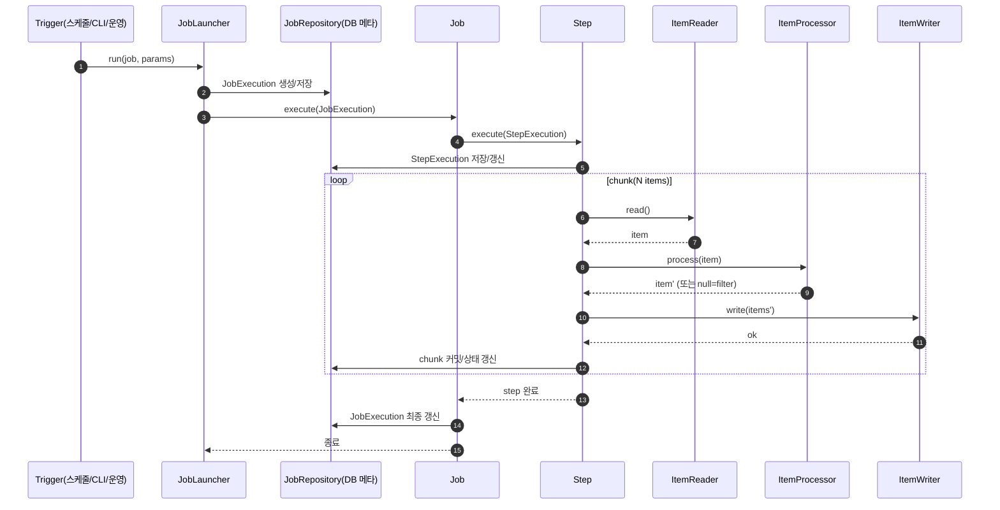

## Spring Batch 공부 자료

Spring Batch는 **대용량 데이터 처리**(읽기 → 가공 → 쓰기)와 **반복/주기 작업**을 안정적으로 수행하기 위한, Spring 기반의 배치 프레임워크입니다.

- **목적**: 대량 데이터 처리, 정합성 있는 재시도/재개(restart), 실행 이력 관리, 청크 처리(chunk processing)
- **전제**: “웹 요청”이 아니라 “작업(Job)을 실행”하는 형태

---

## 배치(Batch) vs 스케줄러(Scheduler)

둘은 경쟁 관계가 아니라 **역할이 다릅니다**.

- **배치(Batch)**: “무엇을 어떻게 처리할지”에 대한 **처리 프레임워크**
  - 예: CSV 10만 줄을 읽어서 검증하고 DB에 업서트한다
  - 예: 하루치 체결 데이터를 집계해서 1분봉을 만든다

- **스케줄러(Scheduler)**: “언제 실행할지”를 담당하는 **실행 트리거**
  - 예: 매일 새벽 6시에 위 배치 Job을 실행한다
  - 예: 5분마다 특정 정리 작업을 실행한다

즉,

- 스케줄러는 **Job 실행 시점**을 제공
- Spring Batch는 **Job 내부의 처리 방식과 운영 기능**(재시작, 이력, 청크 등)을 제공

---

## Spring Batch 처리 방식(대표: Chunk 기반)

배치 작업은 보통 다음 3단계를 반복합니다.

- **ItemReader**: 데이터 읽기(파일/DB/API 등)
- **ItemProcessor**: 변환/검증/필터링(선택)
- **ItemWriter**: 데이터 쓰기(DB/파일/메시지 큐 등)

Chunk 처리에서는 “N개(Chunk size)” 단위로 **Item을 모아서** 처리합니다.

- Reader가 Item을 하나씩 읽어오고
- Processor로 가공/필터링한 결과를 모아
- Writer가 **N개 묶음(List)**을 한 번에 `write()`로 받고
- 그 묶음 단위로 DB 트랜잭션을 **커밋(commit)** 합니다(커밋 간격 = chunk size)

즉, “전체 데이터를 한 번에 메모리에 모아 처리”하는 게 아니라, **N개 단위로 모아 write/commit을 반복**하는 방식이라 대용량에서도 메모리/트랜잭션을 제어할 수 있습니다.

```mermaid
flowchart LR
  S[Step / Chunk loop] -->|read item| R[ItemReader]
  R -->|process item| P[ItemProcessor]
  P -->|buffer items| B[(Chunk buffer)]
  B -->|write(List)| W[ItemWriter]
  W -->|commit tx| C[Commit]
  C -->|next chunk| S
```

장점:

- 대용량 처리에 유리(메모리/트랜잭션 관리)
- 실패 시 재시도/재개를 설계하기 쉬움

---

## 전체 흐름(전반적인 실행 흐름)

Spring Batch를 “코드가 실행되는 순서”로 보면 다음 순서로 이해하는 게 편합니다.

1. 애플리케이션 시작 시 배치 인프라(Repository/Launcher/Explorer 등) 빈이 준비됨
2. Job/Step 빈이 등록됨(필요하면 JobRegistry에 이름으로 등록)
3. 트리거가 Job을 실행함
   - 수동 실행(커맨드)
   - 스케줄러(@Scheduled)
   - 운영 도구(JobOperator)
4. JobLauncher가 JobRepository에 실행 이력을 만들고(JobExecution)
5. Job이 Step을 실행하면서 StepExecution을 남김
6. Chunk Step이면 Reader/Processor/Writer가 N개 단위로 반복 실행/커밋됨
7. 종료 시 JobExecution/StepExecution 상태가 최종 갱신됨




---

## 핵심 구성요소와 관계(큰 그림)

```mermaid
flowchart TB
  JL[JobLauncher] -->|run(job, params)| J[Job]
  J --> S1[Step]
  J --> S2[Step]
  JR[JobRepository] <--> J
  JR <--> S1
  JR <--> S2

  subgraph Step 내부(Chunk)
    R[ItemReader] --> P[ItemProcessor] --> W[ItemWriter]
  end
```

---

## 용어 정리

아래는 Spring Batch에서 자주 등장하는 용어와 의미를 “운영 관점”으로 정리한 것입니다.

### Job

- 배치 작업의 **최상위 단위**
- “종목 마스터 적재”, “정산 집계”, “일봉 생성” 같은 하나의 업무

### Step

- Job을 구성하는 **하위 실행 단위**
- 보통 “읽기/가공/쓰기”로 이루어진 Chunk Step 또는 단일 작업(Tasklet Step)

### JobParameters

- Job 실행에 전달하는 **입력 파라미터**
- 예: `filePath=...`, `encoding=CP949`, `date=2026-02-10`
- 같은 Job이라도 파라미터가 다르면 “서로 다른 실행”으로 취급될 수 있음

### JobInstance

- **Job + JobParameters 조합**으로 식별되는 “논리적 실행 단위”
- 같은 Job을 같은 파라미터로 다시 실행하면 “기존 JobInstance 재실행”으로 간주될 수 있음(설정에 따라 거부/재시작)

### JobExecution

- 특정 JobInstance에 대한 **실제 실행 1회**
- 상태/시작·종료 시각/exit status/실패 원인 등이 남음
- JobExecution 안에는 여러 StepExecution이 연결됨
- “재시작(restart)”은 보통 같은 JobInstance에 대해 **새 JobExecution을 추가로 생성**하는 방식으로 이해하면 쉬움

### StepExecution

- 특정 JobExecution 안에서 Step이 실행된 **실제 실행 1회**
- Step 단위로 성공/실패/처리 건수(read/write/skip)를 기록

### ExecutionContext

- Job/Step 실행 중 필요한 **상태 저장 공간**
- 재시작(restart) 시 “어디까지 처리했는지” 같은 정보를 남기는 용도로 많이 사용
  - 예: 파일 몇 번째 라인까지 읽었는지, 마지막 처리 key 등

### JobRepository

- Spring Batch의 “심장”
- JobExecution/StepExecution/ExecutionContext 등 **메타데이터(이력)**를 DB에 저장/조회
- 운영에서 “실행 이력 조회”, “재시작”, “중복 실행 방지”에 필수

JobRepository가 해주는 대표 기능:

- **중복 실행 제어**: 같은 Job + 같은 JobParameters로 이미 성공한 Instance가 있으면 재실행을 막거나(기본 동작) 정책에 따라 재시작
- **restart를 위한 상태 저장**: StepExecution/ExecutionContext에 “어디까지 했는지”를 기록
- **운영 지표 제공**: read/write/skip/retry 등 카운트/상태 추적

> 실무에서 “배치가 왜 재시작이 안 되지?” 같은 문제는 대부분 JobRepository 메타데이터/파라미터/상태 때문에 발생합니다.

### JobLauncher

- Job을 **실행(run)**시키는 진입점
- `JobLauncher.run(job, jobParameters)` 형태

실무 포인트:

- JobLauncher는 실행 전에 보통 JobRepository를 통해 “실행 가능 여부”를 판단하고(JobInstance/JobExecution 생성)
- 필요하면 비동기(TaskExecutor)로 실행하는 런처를 쓸 수 있음

#### SimpleJobLauncher

- 전통적으로 많이 쓰이던 기본 런처 구현체
- 버전에 따라 **대체 구현**(예: TaskExecutor 기반 런처)이 권장되기도 함
- 핵심 아이디어는 동일: “실행 요청을 받아 Job 실행 + Repository 기록”

### ItemReader / ItemProcessor / ItemWriter

- **Reader**: 입력을 한 건씩 읽어 Item으로 제공
- **Processor(선택)**: Item 변환/검증/필터링(리턴 `null`이면 필터링 의미로 쓰기도 함)
- **Writer**: 처리된 Item들을 모아(Chunk 단위) 출력 대상(DB 등)에 반영

추가로 알아두면 좋은 포인트:

- **상태(stateful) Reader**가 많음: 파일/커서 기반 Reader는 “어디까지 읽었는지” 상태를 가짐 → 재시작을 위해 ExecutionContext에 저장되기도 함
- **Processor는 순수 함수에 가깝게**: 외부 부작용을 최소화하면 테스트/재시작이 쉬움
- **Writer는 멱등성/정합성이 중요**: 재시작 시 동일 데이터가 다시 write될 수 있으므로(상황에 따라) DB 유니크/업서트/멱등키 설계가 중요

예시(개념):

- Reader: `FlatFileItemReader`(CSV), `JdbcCursorItemReader`(DB)
- Processor: 값 정규화(공백 제거, 코드 변환), 검증 실패 필터링
- Writer: `JdbcBatchItemWriter`, `JpaItemWriter`

### Tasklet

- Step을 구성하는 또 다른 방식
- “한 번 실행하고 끝”나는 작업에 적합
  - 예: 파일 이동, 임시 테이블 truncate, 단일 API 호출, 단일 SQL 실행 등

### JobExplorer

- JobRepository에 저장된 **실행 이력**을 “조회”하는 용도(읽기 전용)
- 운영 화면/관리 도구에서 이력 조회할 때 유용

### JobRegistry

- 애플리케이션에 등록된 Job들을 **이름(name)으로 조회**할 수 있게 보관하는 레지스트리
- 운영 도구(JobOperator)가 “jobName으로 실행/재시작”할 때 유용

### JobRegistryBeanPostProcessor

- 스프링 컨테이너에 등록되는 Job 빈들을 감지해서 JobRegistry에 자동 등록해주는 BPP(BeanPostProcessor)
- “Job을 이름으로 찾는 운영 기능”을 쉽게 만들고 싶을 때 함께 사용

### JobOperator

- Job을 운영 관점에서 제어하는 API 집합
  - start/stop/restart/abandon 등
- 배치 운영 콘솔을 만든다면 자주 등장

JobOperator가 보통 의존하는 것들:

- JobLauncher(실행)
- JobRepository/JobExplorer(이력 조회/상태 확인)
- JobRegistry(이름으로 Job 찾기)

---

## `@EnableBatchProcessing` / `BatchConfigurer` / `FactoryBean`

### `@EnableBatchProcessing`

- Spring Batch 인프라 빈들을 구성해주는 “활성화” 어노테이션입니다.
- 일반적으로 아래 같은 것들을 자동 구성(또는 구성 선택)하는 역할을 합니다.
  - JobRepository
  - JobLauncher
  - JobExplorer
  - JobBuilder/StepBuilder에 필요한 기반 객체들

> Spring Boot를 쓰면 “자동 구성”이 많이 해주기 때문에, 상황에 따라 `@EnableBatchProcessing`을 직접 안 붙여도 동작하는 구성이 가능합니다. (프로젝트/버전에 따라 다름)

### BatchConfigurer

- 배치 인프라 (JobRepository / JobLauncher / TransactionManager 등)를 “커스터마이징”하기 위한 확장 포인트로 소개되는 경우가 많습니다.
- 다만 최신 버전에서는 다른 방식(기본 배치 설정 클래스를 확장하거나, 필요한 빈을 직접 제공)이 더 권장될 수 있습니다.

핵심은 “어떤 이름의 인터페이스/클래스를 쓰든” 결국 아래를 내가 결정할 수 있게 하는 것이 목적입니다.

- 메타데이터를 어디 DB에 저장할지(JobRepository)
- 어떤 트랜잭션 매니저를 쓸지
- 런처를 동기/비동기로 실행할지

### FactoryBean (네임스페이스 / 팩토리 빈 / AOP·트랜잭션 제어)

FactoryBean은 스프링의 특별한 타입입니다.

- `FactoryBean<T>` 자체가 “빈”이지만,
- 컨테이너가 외부에 노출하는 건 **FactoryBean이 만들어낸 T 객체**입니다.
- FactoryBean 자체를 받고 싶으면 빈 이름 앞에 `&`를 붙여 조회합니다(예: `&myFactoryBean`).

왜 배치 문서에서 자주 나오나?

- XML 네임스페이스 기반 설정(예: `<job/>`, `<step/>`)은 내부적으로 “Job/Step을 만들어주는 팩토리 빈”을 사용해 구성되는 경우가 있습니다.
- 또한 배치는 `@StepScope`, `@JobScope` 같은 **스코프 프록시**(지연 생성/파라미터 주입)를 많이 쓰는데, 이때도 “프록시/생성 시점 제어”가 중요한 포인트가 됩니다.
- 트랜잭션/AOP는 “어떤 객체를 실제로 실행할지(프록시 vs 타깃)”가 중요해서, 팩토리/프록시 개념이 함께 등장합니다.

---

## “왜 Spring Batch를 쓰나?” 정리

단순히 `@Scheduled`로도 배치를 만들 수 있지만, 아래가 중요해지면 Batch의 가치가 커집니다.

- **재시작/재개(restart)**: 실패했을 때 처음부터가 아니라 “중간부터” 다시 시작
- **실행 이력/감사(audit)**: 언제 어떤 파라미터로 실행되었고 몇 건 처리했는지
- **대용량 안정성**: chunk 기반 트랜잭션/리소스 관리
- **skip/retry 정책**: 일부 데이터 오류는 스킵하고 전체는 계속 진행

---


